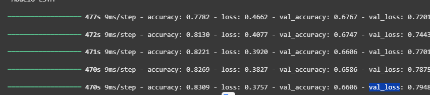

# Análise de Sentimentos com Deep Learning e Streamlit

Este é um projeto de Processamento de Linguagem Natural (PLN) que consiste em uma aplicação web interativa para análise de sentimentos. A aplicação utiliza um modelo de Deep Learning (LSTM) treinado para classificar textos em inglês como "Positivo" ou "Negativo" e é construída com Streamlit para permitir testes diretamente no navegador.

##  Acurácia
#  treinamento

##  Objetivo da Aplicação

O principal objetivo desta aplicação é fornecer uma demonstração prática e interativa do modelo de análise de sentimentos. Ela serve para:

-   **Validar o Modelo**: Permitir testes com diferentes tipos de frases para avaliar a performance e o comportamento do modelo em cenários variados.
-   **Interface Acessível**: Oferecer uma maneira fácil para que pessoas sem conhecimento técnico possam interagir com um modelo de Machine Learning.
-   **Portfólio de Projeto**: Servir como um projeto completo que abrange desde o treinamento de um modelo até sua implantação em uma aplicação web funcional.

##  Sobre a Base de Dados (Sentiment140)

O modelo foi treinado utilizando o dataset **Sentiment140**, um recurso amplamente conhecido e utilizado na comunidade de PLN.

-   **Fonte**: O dataset foi criado por pesquisadores da Universidade de Stanford para o artigo *"Twitter sentiment classification with distant supervision"*.
-   **Conteúdo**: É composto por 1.6 milhão de tweets em inglês.
-   **Rotulagem**: A classificação dos tweets foi feita através de um método de **supervisão à distância**. Os tweets não foram rotulados manualmente; em vez disso, o sentimento foi inferido pelos emoticons presentes no texto:
    -   Tweets contendo emoticons como `:)` e `:-)` foram rotulados como **positivos (4)**.
    -   Tweets contendo emoticons como `:(` e `:-(` foram rotulados como **negativos (0)**.
-   **Estrutura**: O arquivo `.csv` original contém 6 colunas, mas para este projeto, as mais importantes são `target` (o rótulo do sentimento) e `text` (o conteúdo do tweet).

##  Como a Aplicação Funciona

A aplicação combina um backend de Machine Learning com um frontend interativo.

### Backend: O Modelo de Machine Learning

O cérebro da aplicação é um modelo de Rede Neural Recorrente (RNN).

-   **Arquitetura**: Foi utilizada uma **LSTM (Long Short-Term Memory)**, arquitetura ideal para o processamento de dados sequenciais como texto.
-   **Pré-processamento**: Antes da análise, o texto é convertido em números (tokens) através de uma camada `TextVectorization` do Keras. Esta etapa é crucial e garante que a entrada para o modelo seja padronizada.
-   **Modelo de Inferência**: O modelo final utilizado pela aplicação está no formato `.tflite`. Este é um formato leve e otimizado do TensorFlow, ideal para implantações rápidas e eficientes.
-   **Dependência de Dois Arquivos**: Para funcionar, a aplicação carrega dois arquivos:
    1.  `modelo_tweet.keras`: O modelo Keras original é carregado em cache apenas para se obter a camada `TextVectorization` com o vocabulário correto.
    2.  `modelo.tflite`: Este é o modelo otimizado que efetivamente realiza a previsão de sentimento a partir dos tokens gerados.

### Frontend: A Interface Interativa

A interface do usuário é construída inteiramente em Python.

-   **Framework**: A interface foi desenvolvida com a biblioteca **Streamlit**.
-   **Fluxo de Interação**:
    1.  O usuário digita uma frase em inglês na caixa de texto.
    2.  Ao clicar no botão **"Analisar Sentimento"**, o texto é enviado para o backend.
    3.  O texto passa pela camada `TextVectorization` para ser tokenizado.
    4.  Os tokens são inseridos no interpretador TFLite, que executa o modelo.
    5.  O modelo retorna uma probabilidade (um número entre 0 e 1).
    6.  A aplicação interpreta essa probabilidade (valores > 0.5 são positivos, < 0.5 são negativos) e exibe o resultado final de forma clara e visual para o usuário.

##  Tecnologias Utilizadas

-   **Python**
-   **TensorFlow / Keras**: Para o treinamento e construção do modelo LSTM.
-   **TensorFlow Lite**: Para a otimização e inferência do modelo.
-   **Pandas**: Para manipulação de dados.
-   **Streamlit**: Para a construção da interface web interativa.

